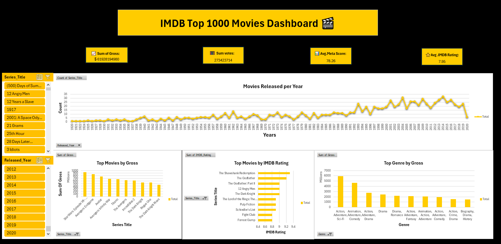

# 🎬 IMDB Top 1000 Movies Dashboard

An interactive dashboard created in Microsoft Excel to explore the top 1000 movies on IMDB.  
It includes KPIs, slicers, and visual charts for deeper insights.

---

## 📊 Features:
- KPI Cards for:
  - Total Gross
  - Average IMDB Rating
  - Average Meta Score
  - Total Votes
- Slicers by:
  - Movie Title
  - Release Year
- Charts:
  - Movies Released per Year
  - Top Movies by Gross
  - Top Movies by IMDB Rating
  - Top Genre by Gross

---

## 📁 Files Included:
- `IMDB-Dashboard.xlsx` — The Excel dashboard with pivot tables and slicers.
- `IMDB-Dashboard.PNG` — A preview image of the dashboard.

---

## 💡 Notes:
- Created as part of my data analysis practice using Excel.
- All visuals are dynamic and connected to slicers.
